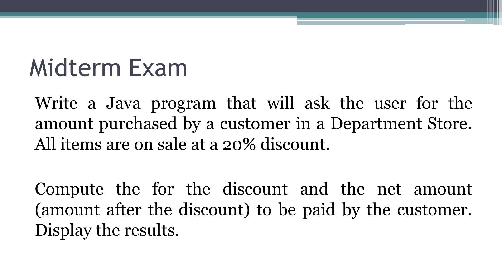

# ITCS-repo/MidExam_ITCS112LA
projects and studies. est. 2022

Direction. Create a Java program to solve the problem below. Use
1) The command prompt for Input and Output (Surname_MidtermExamA.java)
2) The dialog box for Input and Output (Surname_MidtermExamB.java)
       

        
